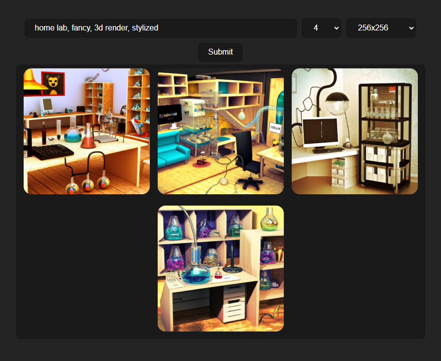

# GUI for OpenAI image generation

This is a GUI for the [OpenAI image generation](https://openai.com/blog/image-gpt/) project.



## How to use

0. Install [Node.js](https://nodejs.org/en/) (tested with v16.19.0)
1. Clone this repository
2. Install the dependeciens with `yarn`
3. Get an API key from [OpenAI Account API Keys](https://beta.openai.com/account/api-keys)
4. Create a `.env` file with the following content:

```env
VITE_OPENAI_API_KEY=
```

5. Run the app with `yarn dev`
